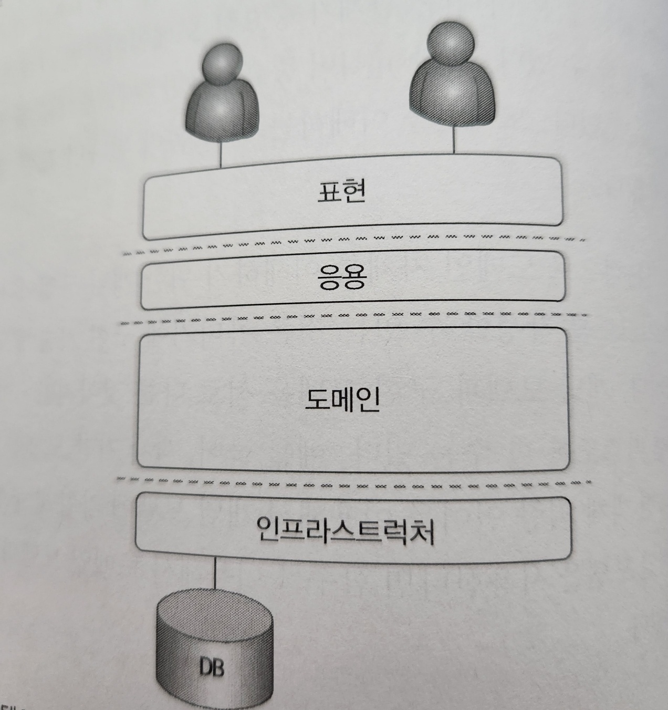

# 도메인 모델 패턴

<figure><figcaption></figcaption></figure>

일반적인 애플리케이션의 아키텍쳐는 4개의 층으로 구성됨.

* **UI**
  * 사용자의 요청을 처리하고 사용자에게 사용자에게 정보를 줌, 사용자는 소프트웨어를 사용하는 사람뿐만 아니라 외부 시스템 사용자도 될 수 있음.
* **Application**
  * 사용자가 요청한 기능을 실행. 업무 로직을 직접 구현 x. 도메인 계층을 조합해서 기능을 실행
* **Domain**
  * 시스템이 제공할 도메인의 규칙을 구현
* **Infrastructure**
  * 데이터베이스나 메시징 시스템과 같은 외부 시스템과의 연동을 처리

### PEAA(엔터프라이즈 애플리케이션 아키텍처 패턴)

도메인 모델은 아키텍처상의 도메인 계층을 객체 지향 기법으로 구현하는 패턴

예를 들어 주문 도메인의 경우 ‘출고 전에 배송지 변경 가능’ 이라는 규칙과 ‘주문 취소는 배송 전에만 할 수 있다’ 는 규칙을 구현한 코드가 도메인 계층에 위치함.

이런 도메인 규칙을 객체 지향 기법으로 구현하는 패턴이 도메인 모델 패턴이다.

```java
public class Order {

	private OrderState state;
	private ShippingInfo shippingInfo;

	public void changeShippingInfo(ShippingInfo newShippingInfo) {
		if(!state.isShippingChangeable()) {
			throw new IllegalStateException("can't change shipping in" + state);
		}
		this.shippingInfo = newShippingInfo;
	}

	public void changeShipped() {
		// 로직 검사
		this.state = OrderState.SHIPPED;
	}
...
}

public enum OrderState {
	PAYMENT_WAITING {
		public boolean isShippingChangeable() {
			return true;
		}
	},
	PREPARING {
		public boolean isShippingChangeable() {
			return true;
		}
	},
	SHIPPED,DELIVERING, DELIVERY_COMPLETED;
	
	public boolean isShippingChangeable() {
		return false;
	}
}
```

위 코드는 주문 도메인의 일부 기능을 도메인 모델 패턴으로 구현한 것.

**OrderState**는 주문 대기 중이거나 상품 중비 중에는 배송지를 변경할 수 있다는 도메인 규칙을 구현함.

배송지 정보를 변경하는 **Order** 클래스의 **changeShippingInfo()** 메서드는 **OrderState** 의 **isShippingChangeable()** 메서드를 이용해서 변경 가능 여부를 확인 한 후 변경 가능한 경우에만 배송지를 변경함.

**OrderState** 는 **Order** 에 속한 데이터 이므로 배송지 정보 변경 가능 여부를 판단하는 코드를 **Order** 로 이동 할 수 있음.

_**Order** 클래스에서 판단하도록 수정한 코드_

```java
public class Order {

	private OrderState state;
	private ShippingInfo shippingInfo;

	public void changeShippingInfo(ShippingInfo newShippingInfo) {
		if(!state.isShippingChangeable()) {
			throw new IllegalStateException("can't change shipping in" + state);
		}
		this.shippingInfo = newShippingInfo;
	}
	private boolean isShippingChangeable() {
		return state == OrderState.PAYMENT_WAITING || state == OrderState.PREPARING;
	}
	...
}

public enum OrderState {
	PAYMENT_WAITING, PREPARING, SHIPPED, DELIVERING, DELIVERY_COMPLETED;
}
```

**OrderState** 에서 **Order** 로 옮긴 이유는 판단할 규칙이 주문 상태와 다른 정보를 함께 사용한다면 배송지 변경 가능 여부 판단을 **OrderState** 만으로 할 수 없으므로 로직 구현을 **Order** 로 옮김

⭐배송지 변경 가능 여부를 판단하는 기능이 **Order** 에 있든 **OrderState** 에 있든 중요한 점은 주문과 관련된 중요 업무 규칙을 주문 도메인 모델인 **Order** 나 **OrderState** 에서 구현한다는 점이다.

핵심 규칙을 구현한 코드는 도메인 모델에만 위치하기 때문에 규칙이 바뀌거나 규칙을 확장해야 할 때 다른 코드에 영향을 덜 주고 변경 내역을 모델에 반영할 수 있게 한다.
