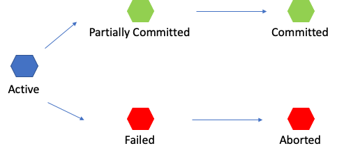

# 🎓 트랜잭션

## Transaction

* 더 이상 분할이 불가능한 업무처리의 단위 = 수행됭야 할 일련의 연산 모음
*   데이터베이스의 상태를 변경시키기 위해 수행하는 작업 단위

    상태변경 : SELECT, UPDATE, INSERT, DELETE 같은 행동을 뜻함.
* 상황에 따라 여러 개가 만들어 질 수 있음.
* Commit 되거나 Rollback 될 수 있음.

**데이터 거래(Transaction) 에 있어서 안정성을 확보하기 위한 방법** = **트랜잭션**

:fast\_forward: CRUD 과정에서 오류 발생 시, 결과를 재반영 하는 것이 아니라 모든 작업을 원상태로 복구하고, 처리 과정이 모두 성공하였을 때 만 그 결과를 반영함.

### 특징

1. 원자성
2. 일관성
3. 독립성
4. 지속성


#### 원자성

원자성은 트랜잭션이 DB에 모두 반영되거나, 전혀 반영되지 않거나를 뜻함.


#### 일관성

**작업 처리의 결과가 항상 일관되어야 한다** 를 뜻함.


#### 독립성

**하나의 트랜잭션은 다른 트랜잭션에 끼어들 수 없고 마찬가리조 독립적임** 을 의미

#### 지속성

**트랜잭션이 성공적으로 완료되면 영구적으로 결과에 반영되어야 함** 을 뜻함.


***

## Transaction 의 Commit 과 Rollback


### Commit

**성공적으로 끝나서 DB가 일관성있는 상태에 있음** 을 의미


### Rollback

**하나의 트랜잭션 처리가 비정상적으로 종료** 되었을 때의 상태를 뜻함.


### Transaction 의 상태

<figure><figcaption></figcaption></figure>

#### 트랜잭션의 5가지의 상태

1.  Active

    트랜잭션이 현재 실행 중인 상태
2.  Failed

    트랜잭션이 실행되다 오류가 발생해서 중단된 상태
3.  Aborted

    트랜잭션이 비정상 종료되어 Rollback 이 수행된 상태
4.  Partially Committed

    트랜잭션의 연산이 마지막까지 실행되고 Commit이 되기 직전 상태
5.  Committed

    트랜잭션이 성공적으로 종료되어 Commit 연산을 실행한 후의 상태

<figure><figcaption></figcaption></figure>

#### Transaction 예외

DDL 문 (CREATE, DROP, ALTER, RENAME, TRUNCATE) 는 transaction 의 rollback 대상이 아니다.


***


## MySQL 에서의 Transaction

DB 의 상태를 바꾸는 일종의 작업 단위

MySQL 에서 입력하는 모든 쿼리 명령어들은 각각 하나의 트랜잭션


INSERT, DELETE, UPDATE 등의 SQL 명령문을 통해 데이터 상태를 바꿀 때마다 내부적으로 자동적으로 Commit 을 실행하여 변경된 내역을 DB에 반영함.

:fast\_forward: git 의 commit 과 유사함.


<figure><figcaption></figcaption></figure>

작업의 단위는 질의어 한문장이 아님..( 쿼리 한줄이 아니다...!)

작업단위란 많은 질의어 명령문들을 사람이 정하는 기준에 따라 정하는 것을 의미함.


## 트랜잭션 문법

Commit 과정

```sql
START TRANSACTION; -- transaction 시작

select * from members; -- 초기 상태 보여준다.

insert into members values(1, '쿠', '크다스', '크라운제과', '?', '대한민국'); -- 데이터 수정

select * from members; -- 수정상태를 보여줌 

COMMIT -- transaction 을 DB 에 적용

select * from members; -- 적용된 결과 조회
```


Rollback 과정

```sql
START TRANSACTION; -- 트랜잭션 시작

insert into members values(5, '쿠', '크다스 동생', '크라운제과', '?', '대한민국'); -- 데이터 수정
select * from members; -- 수정 상태 보여줌

ROLLBACK -- 트랜잭션을 취소하고 START TRANSACTION 실행 전 상태로 롤백함

select * from members; -- 조회
```


