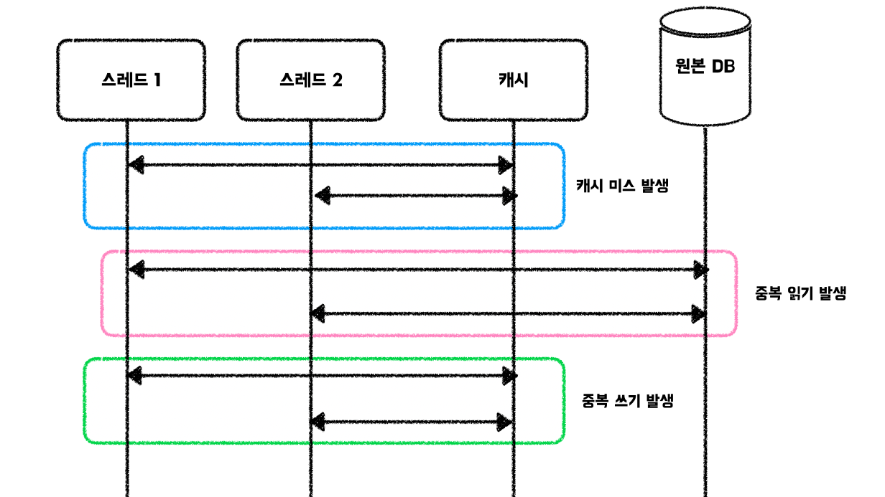

# 캐시 스탬피드 현상

### 캐시 스탬피드 현상이란

대규모 트래픽 환경에서 캐시를 운용하는데, Cache Aside(캐시 미스 발생 시 적재) 전략을 사용한다고 가정.

이때, 수많은 요청들이 동시에 캐시 미스를 확인하고 원본 저장소에서 데이터를 가져와 캐시를 적재하는 상황이 발생할 수 있음.

이를 **캐시 스탬피드 현상 혹은 Thundering Herd 문제** 라고 표현함. 캐시 스탬피드 현상은 원본 데이터베이스와 캐시 성능을 저하할 수 있음.

<figure><figcaption></figcaption></figure>

### 해결방법

해당 방식은 크게 잠금, 외부 재계산, 확률적 조기 재계산 방식으로 풀어볼 수 있음.

#### 잠금(Locking) 방식

* 한 요청 처리 쓰레드가 해당 캐시 키에 대한 잠금을 획득함. 이로인해 다른 요청 처리 쓰레드들은 잠시 대기함. 잠금을 획득한 쓰레드는 사용자 요청에 응답하는 과정동안 캐시 적재 작업은 비동기 쓰레드로 처리할 수 있음. 잠금을 사용하기 때문에 성능 저하 가능성이 존재하며, 잠금 획득 쓰레드의 실패, 잠금의 생명 주기, 데드락 등 다양한 상황을 고려해야함.

#### 외부 재계산(External Recomputation) 방식

* 모든 요청 처리 쓰레드가 캐시 적재를 수행하지 않음. 대신, 캐시를 주기적으로 모니터링하는 쓰레드를 별도로 관리하여 캐시의 만료시간이 얼마 남지 않은 경우, 데이터를 갱신하여 문제를 예방함. 해당 방식은 다시 사용되지 않을 데이터를 포함하여 갱신하기 때문에 메모리에 대한 불필요한 연산이 발생하고, 메모리 공간을 비효율적으로 사용할 가능성이 존재함.

#### 확률적 조기 재계산(Probablistic Early Recomputation) 방식

* 캐시 만료 시간이 얼마 남지 않았을 경우, 확률이라는 개념을 사용하여 여러 요청 처리 쓰레드 중에서 적은 수만이 캐시를 적재하는 작업을 수행하여 스탬피드 현상을 완화할 수 있음.
