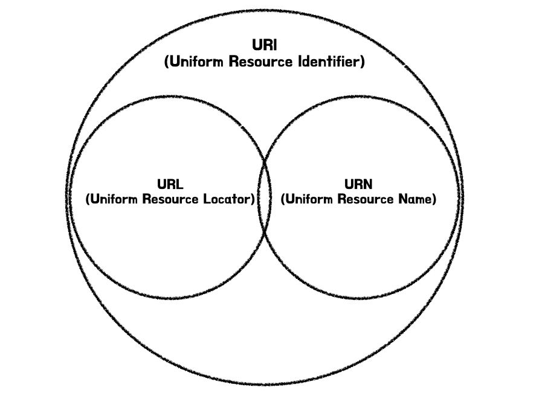

# URI, URL, URN 의 차이점

<figure><figcaption></figcaption></figure>

**URI(Uniform Resource Identifier)** : 인터넷에서 자원을 식별하기 위한 문자열임. URI 는 URN 을 포함하는 상위 개념임. 즉, 특정 자원을 식별하기 위한 포괄적인 방법을 제공하며, 자원 위치나 이름을 나타낼 수 있음.

**URL(Uniform Resource Locator)** : URI 의 한 형태로, 인터넷 상에서 자원의 위치를 나타내는 방식임. 자원이 어디에 있는지를 설명하는데 사용되며, 자원에 접근하기 위한 프로토콜을 포함함. 예를 들어, 웹페이지의 URL은 해당 페이지가 위치한 서버의 주소와 접근 방법(예: HTTP) 을 포함함.

```
https://www.example.com/path/to/resource
```

**URN(Uniform Resource Name)** : URI 의 또 다른 형태로, 자원의 위치와 상관없이 자원의 이름을 식별하는 방식임. 자원의 위치가 변하더라도 동일한 식별자를 유지할 수 있게 함. 특정 스키마를 따르며, 자원에 대한 영구적인 식별자를 제공함.

```
urn:isbn:0451450523(특정 책의 ISBN 번호)
```

