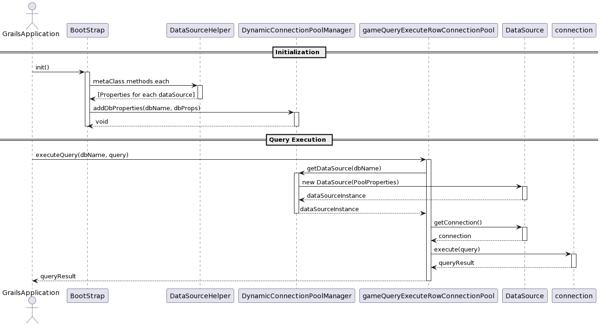

# DB Connection Pool 분리

<figure><figcaption></figcaption></figure>

<figure><figcaption></figcaption></figure>

<figure><figcaption></figcaption></figure>

<figure><figcaption></figcaption></figure>

***

#### 순서

**BootStrap.groovy**  에서 DB Connection Pool 생성 시 필요한 DB Properties 를 Map 에 저장함.

```groovy
private static final ConcurrentHashMap<String, Properties> dbPropertiesMap  = [:]
```

`static final` 키워드는 해당 필드가 클래스의 인스턴스 간에 공유되며, 한번 초기화 되면 그 값이 변경 되지 않음을 의미함.

즉, 변수 자체의 참조가 변경되지 않는다는 것이고, 변수가 참조하는 객체의 내부 상태는 변경될 수 있음.


그 후에 Connection Pool 을 생성하고 있지 않다가 **GameService** 같은 곳에서 DynamicConnectionPoolManager에 있는 getDataSource 호출 시

<pre class="language-groovy"><code class="lang-groovy"><strong>if (!dataSources.containsKey(dataSourceName) || dataSources.get(dataSourceName) == null) {
</strong>            Properties dbProps = dbPropertiesMap.get(dataSourceName)
            if (dbProps != null) {
                try {
                    DataSource dataSource = createDataSource(dbProps)
                    dataSources.put(dataSourceName, dataSource)
                } catch (Exception e) {
                    dataSources.put(dataSourceName, null) // 실패 시 null로 설정
                    throw new RuntimeException("Failed to create DataSource for $dataSourceName: ${e.message}", e)
                }
            } else {
                throw new IllegalStateException("No database properties found for: $dataSourceName")
            }
        }else {
</code></pre>

이 if 절에 걸려서 **createDataSource** 로 **Connection Pool** 을 생성하게 됨.

```groovy
        PoolProperties p = new PoolProperties()
        String dataSourceName = dbProps.get("dataSourceName") // 실제 사용되는 db 이름
        String dbType = dbProps.get("dbType") // mysql, oracle, postgresql, mssql
        p.setUrl(dbProps.get("url").toString())
        p.setDriverClassName(dbProps.get("dbDriver").toString())
        p.setUsername(dbProps.get("username").toString())
        p.setPassword(dbProps.get("password").toString())  
        def connectionProperty =[:]
        if(Environment.current.name == 'test'){
            connectionProperty = dbType == 'oracle'? DataSourceConfig.dbPropertiesForTestOracle.call() : DataSourceConfig.dbPropertiesForTest.call()
        }else if (Environment.current.name == 'production') {
            connectionProperty = dbType == 'oracle'? DataSourceConfig.dbPropertiesForLiveOracle.call() : DataSourceConfig.dbPropertiesForLive.call()
        }
        if(!connectionProperty.isEmpty()){
            ...
        }
        return new DataSource(p)
```

이렇게 처음에 dbPropertiesMap 에 저장된 값을 dataSourceName 으로 가져와서 Connection Pool을 맺는 과정을 거침.


### 이미 있는 Connection Pool 은?

데이터베이스가 점검날 개발사에서 점검을 해버리면 Connection Pool 은 잡고 있는 상태로 네트워크만 끊어져 Connection Pool 이 이상하게 된다.

그렇게 다시 DB 연결이 되서 재시도 하게 되면 이미 닫힌 Connection 에 연결을 넣는다는 error 가 나오게 된다.

그러므로 getDataSource 를 할때

```groovy
}else {
            // 이미 생성된 DataSource에 대한 유효성 검사
            Properties dbProps = dbPropertiesMap.get(dataSourceName)
            DataSource dataSource = dataSources.get(dataSourceName)
            String dbType = dbProps.get("dbType").toString()
            /*
            Connection 이 있다가 네트워크 문제로 끊겼다가 재연결 될때 Exception 이 나옴.
            create 하다가 터졌을 때 dataSource Map 에서 삭제
            valid 통과 시에는 그냥 넘김
             */
            if (!isConnectionValid(dataSource,dbType)) {
                // 유효하지 않은 경우, DataSource 재생성
                try {
                    dataSource = createDataSource(dbProps)
                    dataSources.put(dataSourceName, dataSource)
                } catch (Exception e) {
                    dataSources.remove(dataSourceName) // 실패 시 DataSource 제거
                    throw new RuntimeException("Failed to recreate DataSource for $dataSourceName: ${e.message}", e)
                }
            }
        }
```

이 부분에서 **isConnectionValid** 를 호출해서 **Connection Pool** 이 정상적인지 확인하게 된다.

**isConnectionValid** 에서는&#x20;

```groovy
private static boolean isConnectionValid(DataSource dataSource, String dbType) {
        String query = "SELECT 1"
        if(dbType && dbType == 'oracle'){
            query = "SELECT 1 FROM DUAL" // oracle 은 DUAL 테이블
        }
        try {
            Connection conn = dataSource.getConnection()
            Statement stmt = conn.createStatement()
            stmt.executeQuery(query)
            conn.close()
            return true
        } catch (SQLException e) {
            return false
        }
    }
```

MySQL 의 경우에는 `SELECT 1` , ORACLE 에 경우에는 `SELECT 1 FROM DUAL` 이라는 validation query 를 날려서 Connection 을 확인하게 됨.

좀 높은 버전에서는 **isValid()** 라는 녀석이 있지만 버전이 낮아서 `SELECT 1` 을 날려야함.

`SELECT 1` or `SELECT 1 FROM DUAL` 을 했을 때 안되면 다시 `createDataSource` 를 하게 됨.

***

_하지만 뭐 할때마다 SELECT 1 을 날리면?_

`SELECT 1` 이나 `SELECT 1 FROM DUAL` 의 경우는 많은 요청이 올 시 성능 문제를 일으킬 수 있기 때문에 해당 부분에서는 Connection Pool 생성 시에 옵션 validationTimeout 이 있는지 확인 후에 소스 수정이 필요할 것으로 보임.


1. Connection Pool 라이브러리를 다시 사용하여 ValidationTimeout 기능을 사용
2. HealthCheck 를 자동
   1. 연결 유효성 검사를 자동화하고, 연결 상태를 실시간으로 모니터링할 수 있는 시스템을 구축하는 것이 좋을듯함. 예를 들어 k8s 환경에서는 Liveness Probe 와 Readiness Probe 를 설정하여 컨테이너의 상태를 주기적으로 체크하고, 문제가 발견되면 자동으로 재시작하도록 설정할 수 있음.

***

### 테스트 준비

* DB Connection Pool 제거 부하 테스트
* 호출하는 API : testApi/checkExistIngameAccount
* 호출 가는 DB  : TESTGAMEACCOUNT(MySQL)

```sql
SELECT * FROM account;
```

Connection 확인 한 쿼리

```sql
SHOW STATUS LIKE 'Threads_connected';
```

***

### 테스트 시작


#### 분리 미적용

* 쿼리 실행 전

<figure><figcaption></figcaption></figure>

* 1만건 이상 요청 시

<figure><figcaption></figcaption></figure>

시간 : 1분


#### 분리 적용

* 쿼리 실행 전

<figure><figcaption></figcaption></figure>

* 1만건 이상 요청 시&#x20;

<figure><figcaption></figcaption></figure>

시간 : 6분


여기에는 문제가 있음.&#x20;

왜냐하면 StartUp 시 Connection Pool 을 잡기 전에 들어간거여서 시간이 오래 걸린 거였음..

아래는 Connection Pool 을 미리 다 잡은 상태에서 테스트 시의 결과임.

<figure><figcaption></figcaption></figure>

시간 : 1분 30초

***

### 결론

초반만 Connection Pool 을 생성하는 작업 때문에 시간이 걸리지만 Connection Pool 을 잡고 하면 Connection 수는 늘어나지만 속도는 조금 더 빨라짐.

추가적으로 다른 Game DB 의 네트워크 연결이 안되어도 본사 플랫폼 DB 만 연결이 된다면 start up 이 가능해짐.

점검 날 DB 점검 유무 상관 없이 배포를 할 수 있음.
