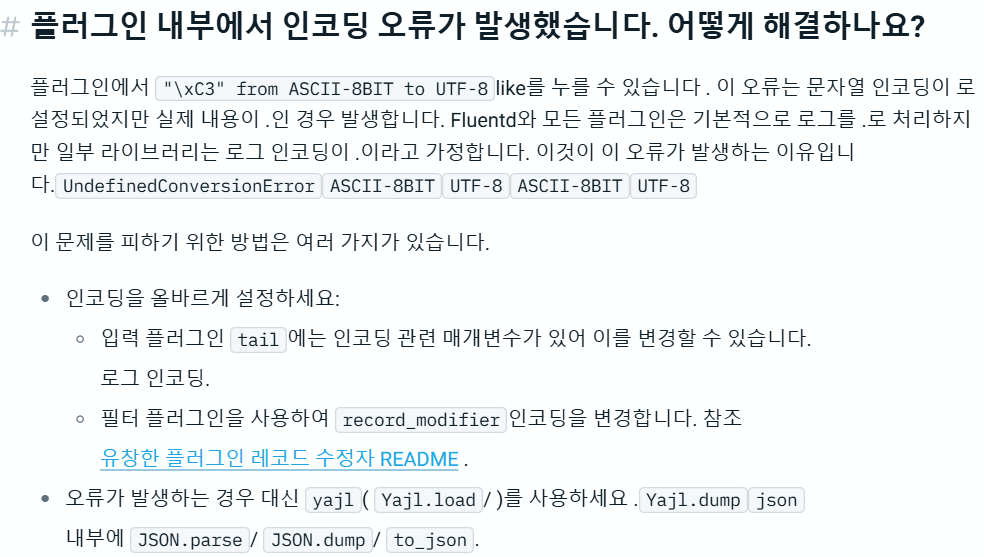

# ASCII-8BIT to UTF-8 Error

Fluentd 를 실제 서버에 올려놓고 로그 수집을 기다리는 중에 중국어와 json 로그를 전송하던 중에

`\xE6 from ASCII-8BIT to UTF-8` 에러가 나와서 로그가 정상적으로 발송되지 않는 현상이 일어남.

이러한 에러는 서버에서 보내는 로그 형식이 UTF-8 인데 인코딩이 잘못되는 경우임.

지금 회사는 대만 회사여서 중국어가 로그에 포함되어 있는 경우가 있는데 이 때 발생하는 에러인 것을 확인.

tag 안에서 tail 밑에 encoding UTF8 을 적어 중국어가 깨져도 로그가 정상 발송 되는 것을 확인했음.

```xml
<source>

   @type tail

   encoding utf8

...

</source>
```

문제는 JSON 형식으로 보낼 때 \xE6 에러가 아닌 \xC 계열로 예외가 발생하는데 이 때는 format 을 json 이 아닌 yajl 을 사용하라고 공식문서에 나와있음.

[https://docs.fluentd.org/quickstart/faq#i-got-encoding-error-inside-plugin-how-to-fix-it](https://docs.fluentd.org/quickstart/faq#i-got-encoding-error-inside-plugin-how-to-fix-it)

<figure><figcaption></figcaption></figure>

```xml
<source>

  @type tail

  foramt yajl

...

</source>
```

***

위 방식 처럼 했는데도 안되서 추가적인 플러그인을 설치해줬다

```shell
cd ./gem install fluent-plugin-record-mopdifier
```

이 플러그인을 설치 후

```xml
<filter pattern>
  @type record_modifier

  # set UTF-8 encoding information to string.
  char_encoding utf-8
</filter>
```

이렇게 설정 해주면 중국어도 깨져서 나오지도 않고 잘 나온다.
