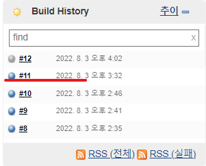
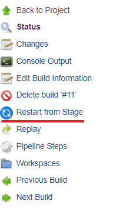
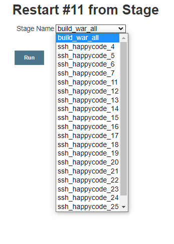
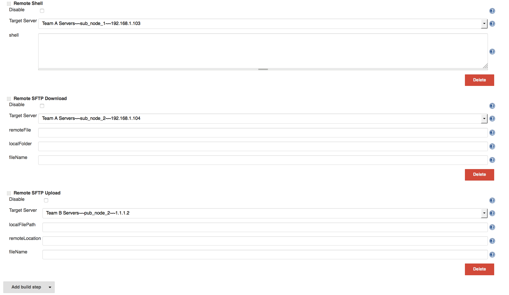

# Jenkins

회사 게임 오픈에 대비해서 서버 개수를 늘리기로 함.

* 기존 서버 8대(프론트, 백엔드) ⇒ 20대로 증설

젠킨스로 여러 서버 빌드 할 때 동시에 빌드를 하면 젠킨스 서버의 CPU 가 98% 까지 튀어서 젠킨스가 멈추는 상황 + 소요시간이 더 오래 걸리는 게 확인이 되었음.

PIPELINE 기능을 활용하여 Script 작성 후 동시에 여러 대를 묶어서 빌드 하는 것이 가능


### 파이프라인 구축 전

<figure><figcaption></figcaption></figure>

**파이프라인 구축 전 1대의 서버 당 6 \~ 9분 정도의 시간이 걸림**

### 파이프 라인 구축 후

<figure><figcaption></figcaption></figure>

**파이프라인 구축 후 4대의 서버 배포 시 11분의 소요 시간이 걸림**


#### **방식의 문제**

* **기존**
  * 각 서버마다 하나 씩 젠킨스 프로젝트를 돌림
  * 하나씩 올라갈 때마다 tail 명령어로 잘 올라갔는지 확인
  * 스카우터가 붙는지 확인 후 다음 프로젝트 실행
* **파이프라인 설정 후**
  * build 한번 클릭 후 11분 정도 대기 ⇒ 끝

기존 방식은 하나하나 build 된 war 파일을 서버로 옮겨서 배포 스크립트를 실행 시키는 방식으로 해서 배포 할 때 빌드를 기다리는 시간이 많이 걸림.


파이프라인 방식은 하나의 프로젝트만 빌드 후 send build file 기능으로 각 서버로 war 파일을 전송 후 스크립트만 실행. 초기 빌드만 아니면 각 서버당 톰캣 올라가는 시간 3분 소요(sleep 으로 대기하는 시간 포함)

***

#### PIPELINE 아이템 생성 방법

**Jenkins 에서 새로운 Item 클릭**

<figure><figcaption></figcaption></figure>

**PIPELINE 클릭**

<figure><figcaption></figcaption></figure>

**PIPELINE 스크립트 작성**

```groovy
pipeline{
    agent any
    options {
     timeout(time: 1, unit: 'HOURS') # tail 걸면 time out이 나므로 pipeline이 전체 시간 얼마정도 걸리는지 확인 후 설정
    }
    stages{
        stage('build_war_all'){ # 백엔드 전체 서버에 war 파일 전송하는 프로젝트(item) 빌드 실행
            steps{
                build 'project name'  # 이렇게 하면 생성 되 있는 프로젝트 가 실행
                
            }
        }
        stage('ssh_1') { # ssh 서버에서 command 실행 시키는 stage 서버 ip 별로 stage 분리 , 총 20개
            steps([$class: 'BapSshPromotionPublisherPlugin']) {
                sshPublisher(
                    continueOnError: false, failOnError: true,
                    publishers: [
                        sshPublisherDesc(
                            configName: "project name 1",//Jenkins 시스템 정보에 사전 입력한 서버 ID
                            verbose: true,
                            transfers: [
                                sshTransfer(
                                    execCommand: "echo <server password> | sudo -S ~/release_shell.sh" # 원격지에서 실행할 커맨드
                                )             
                            ]
                        )
                    ]
                )
                sleep(time:180,unit:"SECONDS")  # stage 간 sleep 하는 시간 
            }
        }
        ... # 빌드 돌리고 싶은 프로젝트 개수만큼 stage 생성하면 됨.
    }
}
```

***

### PIPELINE 빌드가 중간에 실패해서 정지되었을 경우

<figure><figcaption></figcaption></figure>

<figure><figcaption></figcaption></figure>

<figure><figcaption></figcaption></figure>

스테이지 선택 후 run 하면 선택한 stage 부터 다시 순차적으로 build 실행함.

***

## JENKINS 최신 버전에서의 PIPELINE

Publish Over SSH 가 최신 버전에서는 사용이 불가능...!

더 이상 원격 배포가 안될듯 보였으나 SSH2 Easy 플러그인으로 해결할 수 있다.

<figure><figcaption></figcaption></figure>

이런식으로 빌드 완료된 파일을 각 서버로 SFTP 원격 업로드 할 수 있는 플러그인이 있어서 가능
